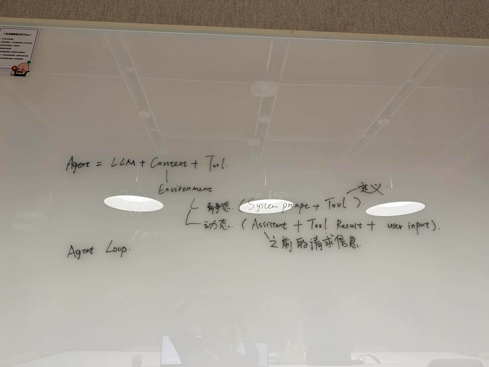
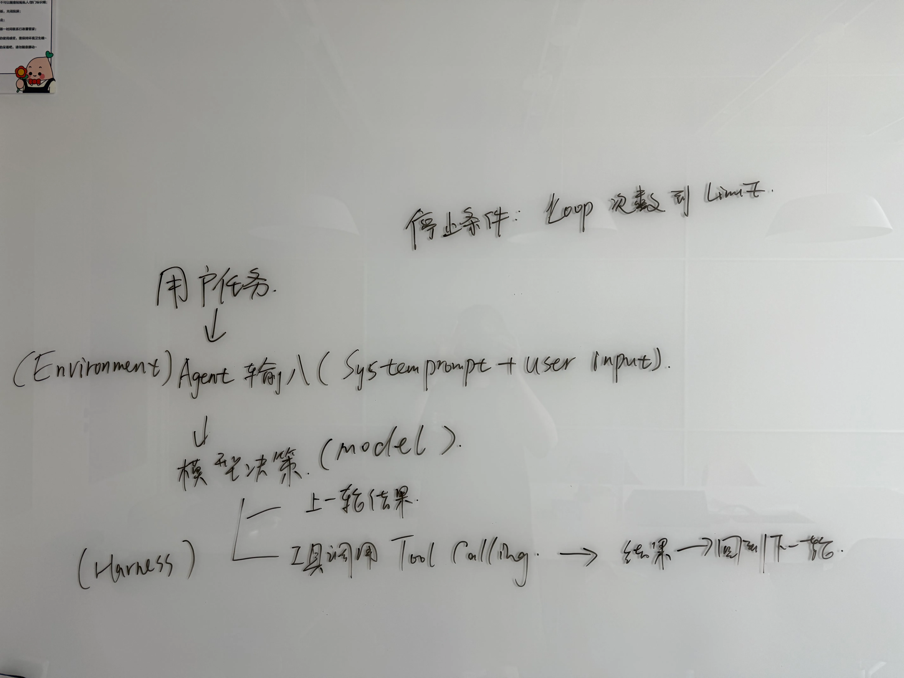

# Day 1：建立 Agent 的最小心智模型

> 学习时间：2026-08-17 07:30–10:00
>
> Notion 原记录：[Day1](https://app.notion.com/p/3be0d28175e78007bfa5dead2412d9c7)
>
> 导出时间：2026-08-19

这份文档保留了第一天的学习计划、原始答案、两版手绘图、口头讲解和 Notion 评论。原始答案不做事后润色；纠错意见单独保留，方便观察认知变化。

## 今日目标

不看资料，能够画出 Agent 最小状态循环，并从“执行路径由谁决定”这个角度区分 Chatbot、Workflow 和 Agent。

原书把第一章定位为整本书的“概念地图”，首次阅读只需建立整体印象，不需要记住所有框架和细节。[第一章正文](https://bojieli.github.io/ai-agent-book/book/chapter1/)

## 07:30–08:20：阅读与第一次建模

### 闭卷热身

#### 1. Agent 和普通聊天机器人最大的区别是什么？

原始回答：

> 普通的聊天机器人不会执行工具，也没法感知当前环境的最新上下文。Agent 有 LLM 的语言模型处理能力，同时可以感知环境的最新上下文，选择调用什么工具，以及判断何时结束对话。所以它可以自主决策、自主执行，这是最大的区别。

#### 2. 模型发起工具调用之后是谁在执行工具？

原始回答：

> 是 Agent 在执行工具。模型本身只有语言处理能力，没有“四肢”，无法执行动作。

#### 3. 为什么 Agent 需要循环而不是一次调用模型？

原始回答：

> 因为一次调用的结果可能只是某一个工具的返回，所以它需要在多轮调用中不断观察外界输入和环境，然后做出反应。最后当它发现返回里有一个结束标识时，才知道这轮循环结束。

#### 4. Agent 如何知道任务已完成？

原始回答：

> 在 Loop 的过程中获得一个结束标识，就知道任务已经完成。

评论纠正：不能只依赖模型给出“结束标识”，还需要考虑模型返回最终回答且无 Tool Call、显式 `final_answer`、验证器确认目标完成，以及 `maxTurns`、超时、用户取消和不可恢复错误等停止条件。[查看原评论](https://app.notion.com/p/3be0d28175e78007bfa5dead2412d9c7?d=3c10d28175e780ffa266001cecf171b9&pvs=42#3c00d28175e780b0ba3be2132b21167c)

### 定向阅读

阅读原书以下部分：

- “现代 Agent = LLM + 上下文 + 工具”
- “上下文：Agent 的眼睛”
- “ReAct 循环”

重点寻找五个问题的答案：

- Model、Harness、Environment 的边界分别在哪里？
- 一次模型调用能看到哪些信息？
- 静态前缀和动态轨迹分别包含什么？
- Tool Call 和 Tool Result 在循环中的位置是什么？
- 循环有哪些停止条件？

原书给出的最小循环明确区分了职责：Model 决定下一步，Harness 校验和调度工具，Environment 产生真实状态变化及观察结果。[ReAct 与最小运行骨架](https://bojieli.github.io/ai-agent-book/book/chapter1/)

### 第一次建模白板

要求至少包含用户任务、模型决策、直接回答与工具调用分支，并标出 Model、Harness、Environment 以及三个停止条件。



## 08:30–09:20：厘清边界与编排方式

### 阅读范围

阅读：

- “Harness 工程：模型之外的竞争力”
- “编排模式：工作流与自主”
- “工作流模式”
- “自主 Agent”

围绕一个判断阅读：

> 当前系统的下一步执行路径，是开发者预先写好的，还是模型根据观察动态决定的？

原书将 Workflow 定义为开发者预先确定路径，而自主 Agent 根据环境反馈实时决定路径；是否调用了 LLM 或工具，本身不足以区分二者。[工作流与自主 Agent](https://bojieli.github.io/ai-agent-book/book/chapter1/)

### Chatbot、Workflow、Agent 对比（原始答案）

| 维度 | Chatbot | Workflow | Agent |
| --- | --- | --- | --- |
| 谁决定下一步 | 用户 | 工作流 | Agent |
| 是否维护任务轨迹 | 否 | 是 | 否 |
| 是否可以使用工具 | 否 | 是 | 是 |
| 是否根据工具结果改变计划 | 否 | 否 | 是 |
| 主要停止方式 | 用户终止对话 | 工作流结束 | 取得结果 |
| 适合的任务 | 简单聊天 | 固定流程的任务 | 自主性强、需要自主决策与执行的任务 |
| 主要风险 | 无法感知环境、调用工具 | 轨迹死板、无法变通 | 任务脱离轨迹 |

评论纠正：

- Agent 必须维护任务轨迹。[查看原评论](https://app.notion.com/p/3be0d28175e78007bfa5dead2412d9c7?d=3c10d28175e780459404001ce729a16a&pvs=42#3be0d28175e780799261d8e2dcefe07f)
- Chatbot 也可能有历史并调用工具，不能绝对填“否”。[查看原评论](https://app.notion.com/p/3be0d28175e78007bfa5dead2412d9c7?d=3c10d28175e780c185fc001cb39aea2e&pvs=42#3be0d28175e7806ea93ddc73df04707e)
- Workflow 可以根据工具结果走开发者预设的条件分支。[查看原评论](https://app.notion.com/p/3be0d28175e78007bfa5dead2412d9c7?d=3c10d28175e78012a04a001cd8ff8912&pvs=42#3be0d28175e780c2b20afeee96877910)
- Agent 的主要风险包括无限循环、错误累积、越权副作用、成本失控和错误完成判断。[查看原评论](https://app.notion.com/p/3be0d28175e78007bfa5dead2412d9c7?d=3c10d28175e78060a377001c03dc3ff9&pvs=42#3be0d28175e7805d9d37f7be81a0c4b7)

### 第一天知识地图

```text
Agent 要解决的问题
├── 最小组成：LLM + Context + Tools
├── Agent 与 Environment 的边界
├── Context：静态前缀 + 动态轨迹
├── Tools：模型提议，Harness 校验和调度
├── ReAct / Agent Loop：状态 → 行动 → 观察 → 更新状态
└── Chatbot、Workflow、Agent：关键区别是下一步路径由谁决定
```

## 09:30–10:00：闭卷验收

### 第二版 Agent Loop

要求体现上下文构造、模型决策、直接回答与工具调用两个分支、参数校验、工具执行、Tool Result 写回轨迹、下一轮，以及正常和异常停止。



### 八道验收题（原始答案）

#### 1. 为什么 `Agent = LLM + 上下文 + 工具` 不包含 Environment？

> 因为上下文就是 Environment。

评论纠正：Context 是 Agent 内部对环境观察和历史的表示，不是环境本身。[查看原评论](https://app.notion.com/p/3be0d28175e78007bfa5dead2412d9c7?d=3c10d28175e780ee9979001c1dfd425e&pvs=42#3c00d28175e780fbb434fd339420c28b)

#### 2. 为什么模型输出一段 `{"tool":"calculator"}` 字符串，不等于系统完成了一次工具调用？

> 这只是输出工具的定义列表，不是在调用工具，它没有入参和出参。

评论纠正：这不是工具定义列表，而是一段“看起来像调用”的普通文本。真正的调用通常还需要专门的 `tool_calls` 结构化字段、调用 ID、符合 Schema 的参数、运行时校验、工具注册表匹配、权限检查和实际调度。[查看原评论](https://app.notion.com/p/3be0d28175e78007bfa5dead2412d9c7?d=3c10d28175e780da80d5001c806227e3&pvs=42#3c00d28175e78030ba31dc30f580e56a)

#### 3. Tool Result 如果没有写回上下文，可能出现哪两类问题？

> 模型没有收到工具调用结果，就可能一直循环调用这个工具；或者以为已经收到结果，实际没有收到，却继续推进循环。

#### 4. 一个固定执行“提取简历 → 打分 → 生成邮件”的系统，即使每一步都调用 LLM，为什么仍可能是 Workflow？

> 因为这是一个固定工作流，没有自主决策的部分，都是按部就班安排好的。它不会根据外界环境的改变调整决策。

#### 5. System Prompt、Tool Definition 和用户消息分别由谁提供，各自解决什么问题？

> System Prompt 和 Tool Definition 都是 Agent 本身的静态消息，每次请求都会带上。用户输入每次不同，是一条动态轨迹。

评论纠正：原回答只区分了静态和动态，没有完整回答“谁提供、解决什么问题”。

- System Prompt：开发者提供，定义职责、边界和行为规则。
- Tool Definition：应用或 Harness 提供，描述可用动作及参数 Schema。
- User Message：用户提供，描述当前目标和输入。

[查看原评论](https://app.notion.com/p/3be0d28175e78007bfa5dead2412d9c7?d=3c10d28175e780b5b472001c0d9d0270&pvs=42#3c00d28175e78059af18daa90fbcf5b0)

#### 6. ReAct 是否要求把模型完整的私有思维过程展示给用户？真正需要保存的工程状态是什么？

> 我觉得需要，这就是 ReAct 循环中的 Thinking 部分，会展示给用户。我不确定对不对。真正需要保存的工程状态是 Observation，也就是它观察到的结果和上下文环境信息。

评论纠正：ReAct 不要求公开私有思维过程。真正应该保留的是可审计的工程轨迹：用户消息、Assistant 文本或结构化 Tool Call、Tool Result、工具错误、轮次、耗时、停止原因，以及必要的简短决策摘要。

```text
当前状态 → 行动 → 可观察结果 → 更新状态 → 下一步行动
```

[查看原评论](https://app.notion.com/p/3be0d28175e78007bfa5dead2412d9c7?d=3c10d28175e780beaef0001c70a1010a&pvs=42#3c00d28175e780d0864be41bcf9d1e36)

#### 7. 模型请求调用不存在的工具时，Model、Harness 和 Environment 分别应该做什么？

> Environment 应该搜索 Tool Definition 里有没有这个工具。Harness 如果没有请求不存在的工具，应该给模型提示。模型收到提示后，自主决定是否有替代方法，以及没有这个工具后应该怎么做。

评论纠正：

- Model：只负责提出调用。
- Harness：查询工具注册表、校验工具名和参数；工具不存在时不调用环境，而是生成结构化错误结果。
- Environment：此次不执行任何操作。
- Model 下一轮：看到错误结果后选择替代工具、修改方案或向用户说明无法继续。

[查看原评论](https://app.notion.com/p/3be0d28175e78007bfa5dead2412d9c7?d=3c10d28175e780309eac001c4e5e41e8&pvs=42#3c00d28175e780de9d5bcbf4193582f4)

#### 8. 用户说“读取项目所有文件，找出 Bug 并修复”，为什么通常无法可靠地用一次 LLM 请求完成？

> 这通常不是一次工具调用就能解决的问题。读文件、找 Bug、修复 Bug 需要多个步骤，而且后面的动作依赖前面工具的执行结果；还要持续校验工具结果并判断目标是否完成，所以无法可靠地在一次请求里完成。

### 两分钟口头讲解（原始转写）

> 首先，Agent 会给大模型带上系统提示词和当前可用工具列表，也就是 Tool Definition。LLM 根据任务选择需要的工具，并返回工具定义、入参和出参。Agent 获取信息后根据工具协议进行 Tool Calling；工具实际上是一个函数。调用完成后，它会把 Tool Result 和之前的系统提示词、工具列表、用户请求及 Assistant 消息一起带回 LLM。LLM 再进行判断：如果任务已经完成并达到想要的结果，它会告诉 Agent 任务已完成；Agent 知道任务结束后终止循环，并向用户输出答案。

需要继续修正的点：模型返回的是结构化 Tool Call，而不是把工具“定义、入参、出参”都重新告诉 Harness；Harness 负责验证、权限检查与真实执行；停止条件也不能只依赖模型自报完成。

## 当天完成标准

- [x] 留下四道热身题的原始答案
- [x] 有一张闭卷画出的 Agent Loop
- [x] 完成 Chatbot、Workflow、Agent 对比表
- [x] 形成六节点知识地图
- [x] 完成八道验收题
- [x] 完成一次两分钟口头讲解
- [x] 能明确说出“模型提出行动，运行时校验和执行行动”

## Notion 评论归档

Notion 页面元数据显示 16 个讨论；导出接口在 2026-08-19 返回 13 个完整讨论线程（其中 1 个已解决）。以下是接口可访问到的全部评论，时间保留为 Notion 返回的 UTC 时间。

| 时间 | 锚点 | 状态 | 评论 |
| --- | --- | --- | --- |
| 2026-08-18 12:11:55 | 第一组答案 | 未解决 | [检查答案](https://app.notion.com/p/3be0d28175e78007bfa5dead2412d9c7?d=3c00d28175e78027bac3001cb98ec1d5&pvs=42#3c00d28175e7807d89b5e4dd74871850) |
| 2026-08-19 02:03:36 | Agent 如何判断完成 | 未解决 | [不能只依赖模型给出“结束标识”；需要最终回答、`final_answer`、验证器、`maxTurns`、超时、取消和错误等条件](https://app.notion.com/p/3be0d28175e78007bfa5dead2412d9c7?d=3c10d28175e780ffa266001cecf171b9&pvs=42#3c00d28175e780b0ba3be2132b21167c) |
| 2026-08-18 12:11:48 | 第一版 Agent Loop | 未解决 | [检查答案](https://app.notion.com/p/3be0d28175e78007bfa5dead2412d9c7?d=3c00d28175e7805abe86001c7feac023&pvs=42#3c00d28175e780ec9a62e9e895245ed5) |
| 2026-08-19 02:00:43 | Agent 是否维护任务轨迹 | 未解决 | [Agent 必须维护任务轨迹](https://app.notion.com/p/3be0d28175e78007bfa5dead2412d9c7?d=3c10d28175e780459404001ce729a16a&pvs=42#3be0d28175e780799261d8e2dcefe07f) |
| 2026-08-19 02:01:06 | Chatbot 是否可以使用工具 | 未解决 | [Chatbot 也可能有历史、调用工具，不能绝对填“否”](https://app.notion.com/p/3be0d28175e78007bfa5dead2412d9c7?d=3c10d28175e780c185fc001cb39aea2e&pvs=42#3be0d28175e7806ea93ddc73df04707e) |
| 2026-08-19 02:01:17 | Workflow 是否根据工具结果改变计划 | 未解决 | [Workflow 可以根据工具结果走开发者预设的条件分支](https://app.notion.com/p/3be0d28175e78007bfa5dead2412d9c7?d=3c10d28175e78012a04a001cd8ff8912&pvs=42#3be0d28175e780c2b20afeee96877910) |
| 2026-08-19 02:01:35 | Agent 主要风险 | 未解决 | [主要风险包括无限循环、错误累积、越权副作用、成本失控和错误完成判断](https://app.notion.com/p/3be0d28175e78007bfa5dead2412d9c7?d=3c10d28175e78060a377001c03dc3ff9&pvs=42#3be0d28175e7805d9d37f7be81a0c4b7) |
| 2026-08-19 01:51:04 | Context 与 Environment | 未解决 | [Context 是 Agent 内部对环境观察和历史的表示，不是环境本身](https://app.notion.com/p/3be0d28175e78007bfa5dead2412d9c7?d=3c10d28175e780ee9979001c1dfd425e&pvs=42#3c00d28175e780fbb434fd339420c28b) |
| 2026-08-19 01:55:22 | 普通 JSON 与 Tool Call | 未解决 | [`{"tool":"calculator"}` 只是普通文本；真实调用还需要结构化字段、ID、Schema、校验、注册表、权限与调度](https://app.notion.com/p/3be0d28175e78007bfa5dead2412d9c7?d=3c10d28175e780da80d5001c806227e3&pvs=42#3c00d28175e78030ba31dc30f580e56a) |
| 2026-08-19 01:57:09 | 三类消息由谁提供 | 未解决 | [System Prompt 由开发者提供；Tool Definition 由应用/Harness 提供；User Message 由用户提供](https://app.notion.com/p/3be0d28175e78007bfa5dead2412d9c7?d=3c10d28175e780b5b472001c0d9d0270&pvs=42#3c00d28175e78059af18daa90fbcf5b0) |
| 2026-08-19 01:52:12 | ReAct 与私有思维 | 未解决 | [ReAct 不要求公开私有思维；应保留可审计工程轨迹](https://app.notion.com/p/3be0d28175e78007bfa5dead2412d9c7?d=3c10d28175e780beaef0001c70a1010a&pvs=42#3c00d28175e780d0864be41bcf9d1e36) |
| 2026-08-19 01:53:40 | 不存在的工具 | 未解决 | [Model 提议，Harness 校验并返回结构化错误，Environment 不执行，Model 下一轮调整](https://app.notion.com/p/3be0d28175e78007bfa5dead2412d9c7?d=3c10d28175e780309eac001c4e5e41e8&pvs=42#3c00d28175e780de9d5bcbf4193582f4) |
| 2026-08-18 12:11:38 | 三类系统对比表 | 已解决 | [检查答案](https://app.notion.com/p/3be0d28175e78007bfa5dead2412d9c7?d=3c00d28175e7802fbec9001c1405b181&pvs=42#3be0d28175e7804c930de4aed8b8c3f4) |

## 参考资料

- [原书第一章](https://bojieli.github.io/ai-agent-book/book/chapter1/)
- [第一章笔记](./README.md)
- [Notion 原始学习记录](https://app.notion.com/p/3be0d28175e78007bfa5dead2412d9c7)
